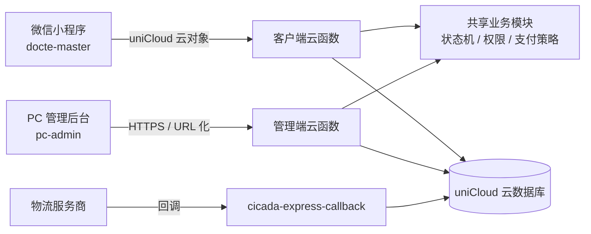

# CICADA 牙科设备检修管理系统

面向牙科设备售后维修场景的多端系统。客户通过微信小程序提交报修并跟踪进度，管理员、工程师、财务和客服通过 PC 后台协同处理工单；两端共用 uniCloud（支付宝云）云函数与云数据库。

> **项目状态**：微信小程序已上线，PC 管理后台已部署。生产环境 PC 后台地址：`https://admin.cicadadental.cn`，uniCloud 生产空间：`env-00jy6g4qwi94` / `cicada-aftersales`。
>
> 当前运行版本位于 `docte-master/` 和 `pc-admin/`。仓库根目录保留了一份不完整的旧版小程序文件，仅用于历史兼容，不应作为开发或部署入口。

## 项目组成

| 模块 | 位置 | 技术栈 | 说明 |
| --- | --- | --- | --- |
| 用户端小程序 | `docte-master/` | uni-app、Vue 3、微信小程序 | 客户报修、进度跟踪、报价确认、支付、物流、设备、投诉建议、政策与客服 |
| PC 管理后台 | `pc-admin/` | Vue 3、Vite、Element Plus、Pinia | 工单、配件库存、结算、客户 CRM、知识库、反馈闭环、系统设置和数据导出 |
| 云端服务 | `docte-master/uniCloud-alipay/` | uniCloud 云函数、云数据库 | 登录、工单状态机、支付与退款、订阅消息、CRM、后台管理接口 |

最权威的架构导览见根目录 [`CLAUDE.md`](CLAUDE.md)。

## 系统架构



## 核心能力

### 客户端小程序
- 微信手机号登录与用户资料维护
- 报修工单提交、图片 / 视频上传入口、设备 SN 绑定与历史查询
- **在保 / 过保自动判定**：有明确质保截止日，或同时具备购机日期 + 已填写的质保月数时才推算；资料不全保持 `unknown` / `pending`，由后台补录后再确认免费或收费，最终以工程师报价为准
- 维修进度、报价确认 / 拒绝、支付状态和回寄物流展示（口径与后台一致）
- 拒绝报价的归档闭环：未拆检自动取消归档，已检测 / 维修的设备走原路回寄后结案
- 地址、投诉建议、发票信息、政策与客服 / 公众号入口
- 「产品视频」统一打开 CICADA 服务号主页；首页产品安装及维护保养视频、公司介绍页产品矩阵图片支持后台配置，并提供内置内容兜底

### PC 管理后台
- **工作台首页**：待办中心（待签收 / 待报价 / 待核销 / 待开票 / 待回寄 / 异常工单）、数据概览
- **报修工单管理**：服务端分页、多条件筛选（状态 / 设备型号 / 发票状态 / 关键词 / 运单号 / SLA 时效）、导出、批量操作、软删除、自定义字段（客户类型 / 对接业务员）、线下手动录单
- **维修报价**：三段式报价（配件 + 服务 + 其他）、草稿保存、报价发布、配件库存绑定与扣减、「报价含配件但未绑库存」告警
- **配件库存管理**：配件目录（编码唯一）、库存流水、库存预警、采购成本按角色隐藏
- **财务中心**：结算核销（微信支付自动确认 + 对公转账人工核销）、微信支付 v3 退款（全额 / 部分、幂等防重）、开票管理（申请 / 登记 / PDF 回传）、四流台账（订单 + 物流 + 资金 + 发票）、应收账龄
- **物流管理**：批量导入（客户寄件 / 回寄两段）、物流台账、异常预警（48h 未揽收 / 72h 停滞）
- **客户 CRM**：客户档案、设备台账、历史工单、标签管理、导入导出、合规访问日志
- **产品故障知识库**：故障 KB、产品分类管理
- **投诉与建议**：反馈处理闭环（分派 / 紧急度 / 回复 / 回访 / 结案），结案前必须有回访记录
- **系统设置**：员工管理（角色 / 权限 / 启用禁用 / 重置密码）、保修政策 / 收费办法文档上传、隐私合规内容、联系方式与公众号配置、小程序首页图文配置、操作审计日志

### 权限与数据安全（RBAC）
- 员工角色：`superadmin`（超级管理员）、`admin`（管理员）、`engineer`（工程师）、`finance`（财务）、`support`（客服）、`maintenance`（后台维护人员）
- `admin` 和 `superadmin` 自动拥有全部已注册权限；其他角色使用角色模板，支持按账号覆盖权限
- 工单列表的客户手机号按角色脱敏，仅 `admin` / `superadmin` 可见完整号
- 配件采购成本仅 `admin` / `superadmin` / `finance` 可见，其他角色不下发成本字段
- 权限唯一真相在 `cicada-order-workflow` 的 `PERMISSIONS` 表，前后端共同遵守；前端菜单级和按钮级权限与后端接口级校验一致

## 订单状态机与数据闭环

工单是整个系统的主线，投诉、发票、设备、物流、付款、回访都挂在**同一张工单**下，不做成独立模块。

- **主状态机**（后端唯一真相，见 `docte-master/uniCloud-alipay/cloudfunctions/common/cicada-order-workflow`）：
  `已提交 → 运输中 → 已签收 → 检测中 → 维修中 → 已回寄 → 已完成`（另有已取消）。
- **子状态**：报价 `quote_status`、付款 `payment_status`、质保 `warranty_status` / `charge_type` 不塞进主状态，前端按「主状态 + 子状态」统一派生显示标签，小程序首页、我的、详情三处口径一致。
- **后端为唯一来源**：支付 / 确认 / 收货后强制回拉工单详情，不在本地缓存里猜状态。
- **闭环动作**：报价确认 / 拒绝维修 → 微信支付或对公转账上传凭证 → 客户确认收货 → 服务评价回访（不满意自动转投诉）。
- **身份桥**：小程序下单时按手机号 / openid 自动匹配或建档 CRM 客户（`cicada_customers`），并把 `customer_id` 回写到工单与设备档案，使小程序与后台是“同一个客户”。
- **设备档案沉淀**：报修提交 / 维修完成时按 SN 自动新增或更新设备档案（型号、购机日期、已明确的质保期限、历史工单），与后台 CRM 设备台账合流；未填写期限时不默认按 12 个月推算。

## 目录结构

```text
docte-master/                客户端小程序 + 共用 uniCloud 后端（运行版本）
├─ api/                      小程序接口封装（auth / repair / content / user / product）
├─ pages/                    小程序主包页面（首页 / 登录）
├─ pages-sub/                小程序分包页面（个人中心 / 地址 / 公司介绍 / 政策 / webview）
├─ components/               小程序组件
├─ store/                    小程序状态管理
├─ utils/                    请求、云函数和通用工具
├─ config/                   资源和业务配置
├─ static/                   小程序静态资源
└─ uniCloud-alipay/          云函数、数据库 schema、公共模块和索引说明
   ├─ cloudfunctions/        9 个云函数 + common 共享模块
   └─ database/              25+ 集合 schema、索引说明、初始化数据
pc-admin/                    PC 管理后台
├─ src/
│  ├─ views/                 页面组件（工单 / 客户 / 库存 / 财务 / 物流 / 知识库 / 反馈 / 设置等）
│  ├─ api/                   后台接口封装（按业务模块拆分）
│  ├─ config/                菜单 / 权限 / API 地址配置
│  ├─ utils/                 请求拦截、权限工具、通用工具
│  └─ router/                路由与守卫
├─ public/                   静态资源
└─ scripts/                  检查脚本（urls / staff / subscription / errors / security）
docs/                        Agent / 协作文档
scripts/                     本地检查脚本
CLAUDE.md                    仓库导览与架构说明（最权威）
AGENTS.md                    AI 协作规则与线上保护规则
goal.md / DEPLOY_GOAL.md     阶段性 / 部署验收目标
INDEX_TASK.md                数据库索引创建说明
后端对接任务清单.md          后端接口补齐清单
```

## 数据库概览

所有集合使用 `cicada_` 前缀，共 25+ 个集合：

- **核心业务**：`cicada_users`、`cicada_orders`、`cicada_order_items`、`cicada_order_events`、`cicada_user_devices`、`cicada_addresses`
- **CRM**：`cicada_customers`、`cicada_customer_logs`、`cicada_customer_tags`
- **库存 / 财务**：`cicada_parts`、`cicada_inventory_flows`
- **内容 / 系统**：`cicada_fault_kb`、`cicada_product_categories`、`cicada_guides`、`cicada_feedbacks`、`cicada_settings`、`cicada_subscription_logs`、`cicada_rate_limits`、`cicada_admin_logs`、`cicada_sn_logs`、`cicada_surveys`、`cicada_password_resets`

Schema 文件位于 `docte-master/uniCloud-alipay/database/*.schema.json`，索引需在 uniCloud 控制台手动创建。

## 环境要求

- Node.js `>= 20.19.0`
- npm
- 微信开发者工具
- HBuilderX 或 uni-app CLI
- 已关联的 uniCloud 云空间（本项目使用支付宝云，目录为 `docte-master/uniCloud-alipay/`）

## 用户端小程序运行

在 `docte-master/` 目录下执行：

```bash
npm install
npm run dev:mp-weixin     # 开发构建，产物在 unpackage/dist/dev/mp-weixin
npm run build:mp-weixin   # 生产构建，产物在 unpackage/dist/build/mp-weixin
npm run check             # 生产构建 + 客户端密钥扫描 + 主包体积校验（本地验收门禁）
```

构建完成后用微信开发者工具打开对应产物目录预览。

## PC 管理后台运行

```bash
cd pc-admin
npm install
cp .env.example .env.local   # PowerShell: Copy-Item .env.example .env.local
npm run dev                  # 默认 http://localhost:5173
npm run build                # 产物输出到 dist/
```

后台通过 URL 化云函数访问 uniCloud，需要在 `pc-admin/.env.local` 或 `pc-admin/src/config/api.js` 中配置实际云函数地址。更多说明见 `pc-admin/配置指南.md`。

## uniCloud 配置

云函数位于 `docte-master/uniCloud-alipay/cloudfunctions/`：

- `cicada-client-user`：微信手机号登录、用户资料、投诉建议提交
- `cicada-client-order`：客户工单创建 / 查询、在保判定、结构化报价暴露、微信支付 JSAPI 创建与回调验签、发票申请、订阅消息触发
- `cicada-client-public`：公共内容、操作指南、故障知识库、政策文档、产品分类、服务评价
- `cicada-admin-sys`（URL 化）：管理员登录、员工管理、系统设置、投诉建议处理闭环（分派 / 紧急度 / 回复 / 回访 / 结案）
- `cicada-admin-order`（URL 化）：工单列表 / 详情 / 状态更新、三段式报价、配件库存、库存流水、结算核销、微信退款、物流批量导入 / 台账 / 异常预警、发票登记、四流台账、待办统计、SLA 预警、线下录单、应收账龄
- `cicada-admin-customer`（URL 化）：客户 CRM 档案、设备台账、历史工单、标签、导入导出、合规日志
- `cicada-admin-kb`（URL 化）：故障知识库 CRUD、产品分类管理
- `cicada-maintenance`：过期限流记录清理、SN 标准化回填、异常数据检查
- `cicada-express-callback`：外部物流状态回调接收与处理

订单状态机、员工权限、发票策略、质保策略和物流供应商适配等共享逻辑位于 `cloudfunctions/common/`。涉及工单状态或角色权限时，应优先修改 `cicada-order-workflow`，并同步管理端云函数中的 fallback 实现。

云函数改动经 HBuilderX「上传并部署」生效；后台云函数需开启 **URL 化**并在 PC 后台配置对应地址。

上线前需要在 uniCloud 控制台手动创建数据库索引，尤其是：

- `cicada_orders.order_no` 唯一索引
- `cicada_users.username` 稀疏索引（sparse）
- 用户工单查询相关的 `user_id + create_time` 复合索引
- 后台状态筛选相关的 `status + create_time` 复合索引

完整索引说明见 `INDEX_TASK.md` 和 `docte-master/uniCloud-alipay/database/INDEXES.md`。

## 关键环境变量

微信登录：`WX_APPID`、`WX_SECRET`

微信支付（含退款）：

- `WX_PAY_APPID`、`WX_PAY_MCH_ID`、`WX_PAY_SERIAL_NO`、`WX_PAY_NOTIFY_URL`
- `WX_PAY_PRIVATE_KEY` 或 `WX_PAY_PRIVATE_KEY_BASE64`
- `WX_PAY_API_V3_KEY`

订阅消息：

- `WX_SUBSCRIBE_TEMPLATE_REPAIR_SUBMIT`
- `WX_SUBSCRIBE_TEMPLATE_DEVICE_RECEIVE_SHIP`
- `WX_SUBSCRIBE_TEMPLATE_PAYMENT_QUOTE`
- `WX_SUBSCRIBE_TEMPLATE_PROCESS_TIP`
- `WX_SUBSCRIBE_TEMPLATE_ORDER_FINISH_INVOICE`

不要把真实密钥写入仓库；本地示例配置参考 `.env.example` 和 `pc-admin/.env.example`。完整上线配置逐条清单见 `docte-master/上线配置清单.md`。

## 接口约定

- 统一返回结构：`{ code, msg, data }`，`code = 0` 表示成功
- 认证请求携带 `Authorization: Bearer {token}`
- 遇到 `401`、`1004` 或 `100401` 时前端清理登录态并跳转登录
- 小程序主流程以 uniCloud 云对象调用为主，微信手机号登录走 `cicada-client-user.login({ code, phoneCode })`

## 上线前检查

1. 创建并核对数据库索引。
2. 配置微信登录、支付（含退款）和订阅消息环境变量。
3. 部署所有 uniCloud 云函数。
4. 开启后台云函数 URL 化，并更新 PC 后台接口地址。
5. 运行小程序 `npm run check`（生产构建 + 客户端密钥扫描 + 主包体积校验）和 PC 后台构建检查。
6. 用准生产数据验证报修、在保判定、报价、支付 / 退款、发票、物流、回访与订阅消息闭环。

PC 后台还提供按功能拆分的检查脚本：

```bash
cd pc-admin
npm run check:urls
npm run check:staff
npm run check:subscription
npm run check:errors
npm run check:security
```

## 参考文档

- [`CLAUDE.md`](CLAUDE.md)：仓库导览与架构说明（最权威）
- [`AGENTS.md`](AGENTS.md)：AI 协作规则、线上小程序保护规则、Git 提交与部署规范
- [`docte-master/README.md`](docte-master/README.md)：小程序与 uniCloud 后端开发说明
- [`pc-admin/README.md`](pc-admin/README.md)：PC 后台开发与验收说明
- [`pc-admin/配置指南.md`](pc-admin/配置指南.md)：PC 后台云函数 URL 化配置指南
- [`docte-master/上线配置清单.md`](docte-master/上线配置清单.md)：支付、订阅消息、物流和索引上线清单
- [`docte-master/uniCloud-alipay/database/INDEXES.md`](docte-master/uniCloud-alipay/database/INDEXES.md)：数据库索引说明
- [`SCALING_GUIDE.md`](SCALING_GUIDE.md)：约 1000 用户容量调优
- [`AFTERSALES_DEPLOY_ACCEPTANCE.md`](AFTERSALES_DEPLOY_ACCEPTANCE.md)：售后流程部署验收
- [`AFTERSALES_QUOTE_GOAL.md`](AFTERSALES_QUOTE_GOAL.md)：售后报价 / 库存 / 结算目标
- [`AFTERSALES_UX_OPTIMIZATION_GOAL.md`](AFTERSALES_UX_OPTIMIZATION_GOAL.md)：售后体验优化目标

## Git 远程仓库

| 远程 | 地址 | 用途 |
| --- | --- | --- |
| `origin` | `huaxie602/docte` | Issue / PRD 追踪 |
| `weichat` | `Mrstongtong828/weiChat-xiaochengxu` | 小程序主仓库（feature 分支默认推送目标） |
| `cicada` | `Mrstongtong828/CICADA-` | CICADA 品牌仓库 |
| `data-guard` | `Mrstongtong828/data-guard` | 数据保护仓库 |

Feature 分支默认跟踪 `weichat`，执行 `git push` 时推送到该远程。
